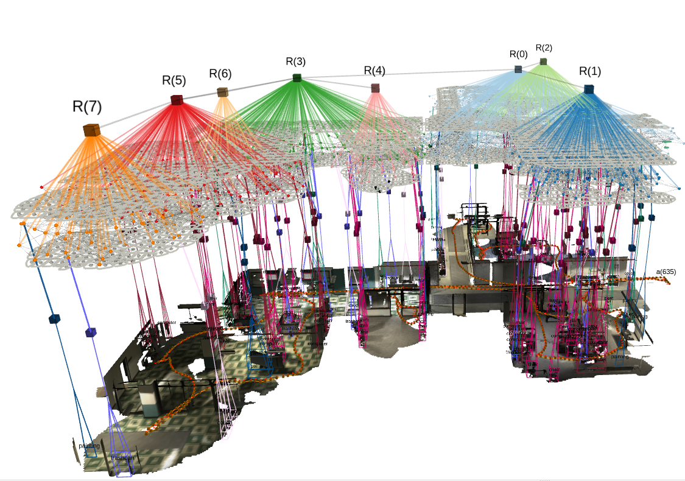

# Hydra Reproduction Analysis

A personal learning project documenting my reproduction and analysis of the **Hydra** semantic 3D scene graph framework developed by the MIT SPARK Lab.

The goal of this repository is **not to develop a new implementation of Hydra**, but to study and understand its design through official pipeline reproduction, source code analysis, and documentation of its system architecture and implementation details.




---

## Project Objectives

- Reproduce the official Hydra pipeline
- Understand Hydra's system architecture
- Read and analyze the core source code
- Learn how RGB-D observations are transformed into hierarchical scene graphs
- Understand how Hydra, ROS 2, and RViz interact within the complete robotics perception pipeline
- Record the complete learning and reproduction process

---

## Repository Structure

```text
Hydra-Reproduction-Analysis/
│
├── README.md
├── report.md
│
├── configs/                         # Configuration documentation
│   ├── system.md                    # Hardware and software environment
│   ├── environment.md               # ROS 2 and dependency setup
│   ├── dataset.md                   # Dataset information
│   └── hydra_config.md              # Hydra configuration analysis
│
├── docs/                            # Study notes and architecture analysis
│   ├── hydra_architecture.md        # Hydra system architecture overview
│   ├── experiment_plan.md           # Experiment roadmap
│   └── code_notes/                  # Core source code analysis
│       ├── hydra_ros_pipeline.md
│       ├── ros_input_module.md
│       ├── frontend_graph_builder.md
│       ├── backend_module.md
│       ├── loop_closure_module.md
│       └── active_window_reconstruction_module.md
│
├── experiments/                     # Reproduction experiments
│   │
│   ├── 01_environment_verification/
│   │   ├── installation_log.md
│   │   ├── system_info.md
│   │   ├── logs/
│   │   └── screenshots/
│   │
│   ├── 02_dataset_comparison/
│   │   └── Dataset analysis and comparison
│   │
│   ├── 03_configuration_analysis/
│   │   └── Hydra parameter and configuration study
│   │
│   ├── 04_pipeline_verification/
│   │   └── Complete Hydra pipeline validation
│   │
│   ├── 05_scene_graph_analysis/
│   │   └── Scene graph layer and RViz visualization analysis
│   │
│   ├── 06_runtime_analysis/
│   │   └── Runtime behavior and performance observations
│   │
│   └── 07_design_analysis/
│       └── Hydra design and implementation analysis
│
├── results/                         # Experimental outputs
│   ├── screenshots/                 # RViz and terminal screenshots
│   ├── logs/                        # ROS 2 execution logs
│   ├── graphs/                      # Generated figures
│   └── tables/                      # Experimental data
│
├── scripts/                         # Helper scripts
│   ├── build_hydra.sh               # Build Hydra workspace
│   ├── run_hydra.sh                 # Launch Hydra pipeline
│   ├── play_rosbag.sh               # Play dataset
│   ├── check_status.sh              # Check ROS nodes/topics
│   └── kill_nodes.sh                # Stop running processes
│
└── Hydra Paper.pdf                  # Reference paper with annotations
```
---

## Documentation

### `docs/hydra_architecture.md`

High-level study notes covering:

- Motivation behind Hydra
- Overall system architecture
- RGB-D processing pipeline
- Hierarchical scene graph layers
- Scene graph optimization
- Personal understanding and diagrams

---

### `docs/code_notes/`

Notes taken while reading the core Hydra source code, including:

- Pipeline workflow
- Module responsibilities
- Data flow between modules
- Important classes and functions
- Personal observations and questions

Core files studied include:

- `hydra_ros_pipeline.cpp`
- `ros_input_module.cpp`
- `reconstruction_module.cpp`
- `graph_builder.cpp`
- `backend_module.cpp`
- `loop_closure_module.cpp`

---

### `docs/experiment_plan.md`

Project planning and learning roadmap.

---

## Reproduction Workflow

```text
Hydra Paper
      │
      ▼
Understand Architecture
      │
      ▼
Read Core Source Code
      │
      ▼
Run Official Hydra Pipeline
      │
      ▼
Observe ROS Topics & RViz
      │
      ▼
Analyze Individual Modules
      │
      ▼
Record Experiments
      │
      ▼
Summarize Findings
```

---

## Current Progress

- ✅ Architecture analysis
- ✅ Core code reading
- 🚧 Hydra reproduction experiments
- 🚧 Result collection
- 🚧 Final report

---

## Disclaimer

This repository is an educational learning project.

It does **not** contain the original Hydra implementation. Instead, it documents my understanding of the framework through paper reading, code analysis, and reproduction experiments.

The study notes were created during my learning process. I used ChatGPT as a study assistant to help explain unfamiliar C++, ROS2, and software architecture concepts. The notes have been reviewed, organized, and supplemented by me to reflect my own understanding. They are intended as learning materials rather than official documentation of the Hydra project.

---

## References

- Hydra: A Real-time Spatial Perception System for 3D Scene Graph Construction
- MIT SPARK Lab – Hydra
- Kimera
- Spark-DSG